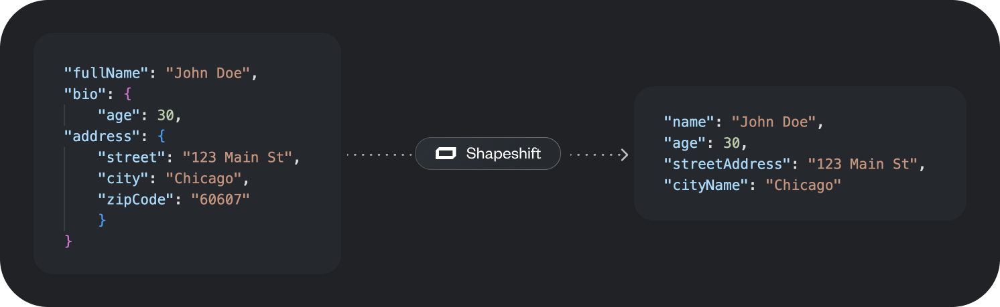

# Shapeshift

Shapeshift is a TypeScript library that maps arbitrarily structured JSON objects using vector embeddings. It uses semantic similarity to match keys between objects, allowing for flexible and intelligent object transformation, including support for nested structures.





## Features

- Map objects with different structures based on semantic similarity of keys
- Support for nested objects
- Multiple embedding providers: Cohere, OpenAI, and Voyage
- Customizable embedding model and similarity threshold
- TypeScript support for type safety

## Installation

```bash
npm install @rectanglehq/shapeshift
```

Ensure you have an API key from your chosen embedding provider (Cohere, OpenAI, or Voyage).

## Usage

Here's an example demonstrating Shapeshift's capability to handle nested objects:

```typescript
import { Shapeshift } from "@rectanglehq/shapeshift";

const sourceObj = {
  personalInfo: {
    name: "John Doe",
    age: 30,
  },
  occupation: "Software Engineer",
  fullAddress: "123 Main St, Anytown",
  address: {
    street: "123 Main St",
    city: "Anytown",
  },
};

// The values of the target object are irrelevant
const targetObj = {
  fullName: "",
  yearsOld: 0,
  profession: "",
  location: {
    streetAddress: "",
    cityName: "",
  },
};

const shapeshifter = new Shapeshift(
  { embeddingClient: "cohere", apiKey: process.env.COHERE_API_KEY || "" },
  { embeddingModel: "embed-english-v3.0", similarityThreshold: 0.5 }
);

const shiftedObj = await shapeshifter.shapeshift(sourceObj, targetObj);
console.log("Shifted object:", shiftedObj);
```

## API

### `Shapeshift` Class

#### Constructor

```typescript
new Shapeshift(
  { embeddingClient: EmbeddingClient, apiKey: string },
  options?: ShapeshiftOptions
)
```

- `embeddingClient`: The embedding provider to use ('cohere', 'openai', or 'voyage').
- `apiKey`: Your API key for the chosen embedding provider.
- `options` (optional):
  - `embeddingModel`: The embedding model to use (default varies by provider).
  - `similarityThreshold`: The minimum similarity score to consider a match (default: 0.5).

#### Methods

##### `shapeshift<T extends ObjectWithStringKeys, U extends ObjectWithStringKeys>(sourceObj: T, targetObj: U): Promise<U>`

Maps the `sourceObj` to the structure of `targetObj` based on semantic similarity of keys, including nested structures.

- `sourceObj`: The source object to map from (can include nested objects).
- `targetObj`: The target object structure to map to (can include nested objects).
- Returns: A promise that resolves to the shifted object with the structure of `targetObj`.

## Supported Embedding Providers and Models

### Cohere

- Default model: 'embed-english-v3.0'

### OpenAI

- Default model: 'text-embedding-ada-002'

### Voyage

- Default model: 'voyage-large-2'

## How It Works

1. The library flattens both the source and target objects, preserving the nested structure information in the keys.
2. It calculates embeddings for the flattened keys of both objects using the specified embedding provider and model.
3. For each key in the flattened source object, it finds the most semantically similar key in the flattened target object using cosine similarity of their embeddings.
4. If the similarity score is above the specified threshold, the value from the source object is mapped to the corresponding key in the target object.
5. Finally, the library unflattens the result, restoring the nested structure of the target object.

## Handling of Nested Objects

Shapeshift can handle nested objects in both the source and target structures. It does this by:

1. Flattening nested objects into a single-level object with dot-notation keys.
2. Performing the semantic matching on these flattened keys.
3. Reconstructing the nested structure in the final output.

This allows for flexible mapping between different object structures, even when the nesting doesn't exactly match.

## Limitations

- The quality of mapping depends on the semantic similarity of key names. Very dissimilar names may not map correctly.
- While the library can handle nested objects, extremely deep nesting may impact performance.

## Contributing

Contributions are welcome! Please feel free to submit a Pull Request.

## License

This project is licensed under the MIT License.
